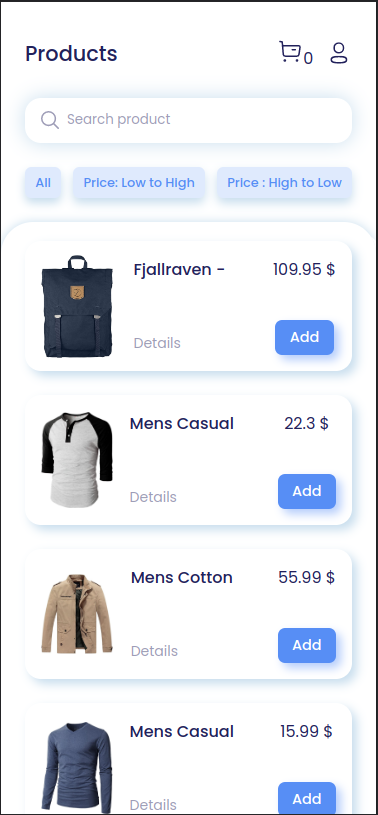
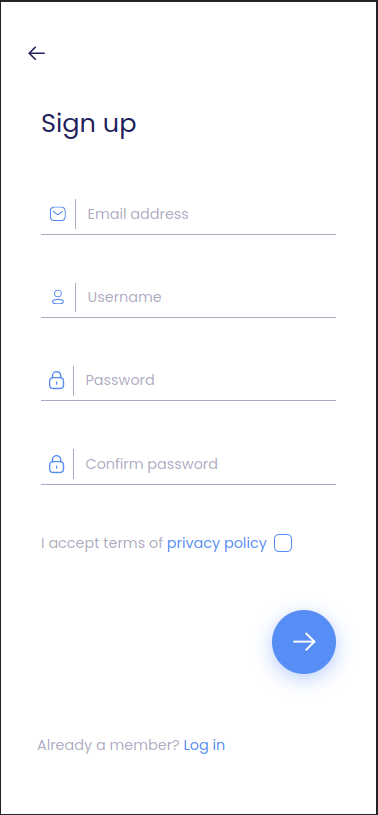

  
  

---

# a minimal shopping cart!

## [review online](https://starlit-baklava-aee57f.netlify.app/)

---

## tips

- Fully responsive for mobile, tablet, laptop and desktop

---

## features

- SPA app (react-router-dom v6)
- Validation form
- Product details page
- Get data in <a target="_blank" href="https://fakestoreapi.com/">API</a> 
- Add and remove item from cart
- Minus and plus quantity cart items
- Reset cart items
- Show total price

---

## web development technologies

- React JS
- Html, Css

---

## contact me

- _[email](mailto:hadikiamarzi@protonmail.com)_
- _[instagram](https://www.instagram.com/ihadikia)_
